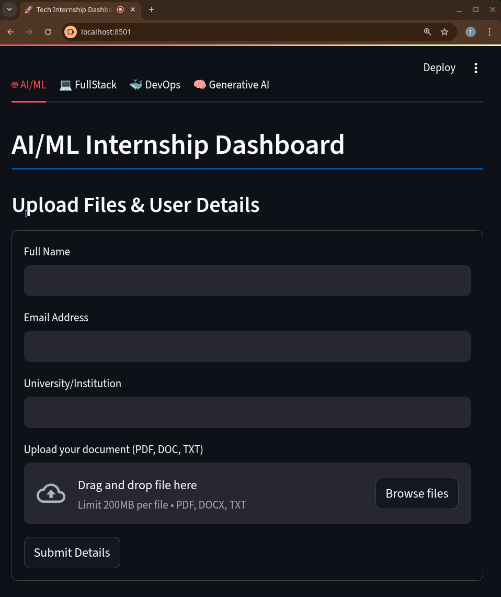
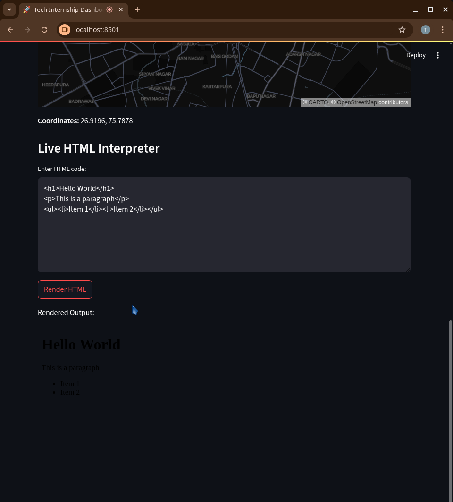
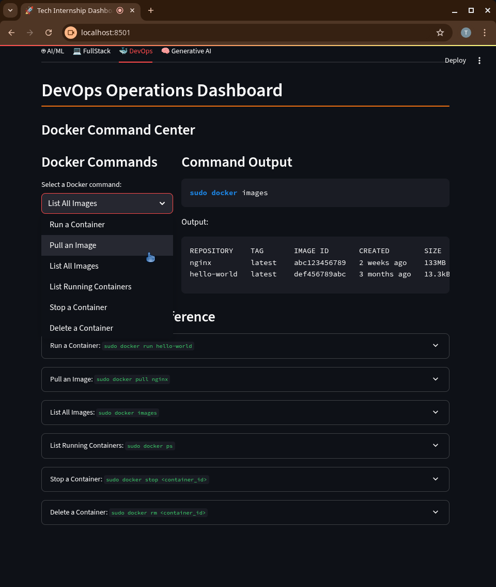
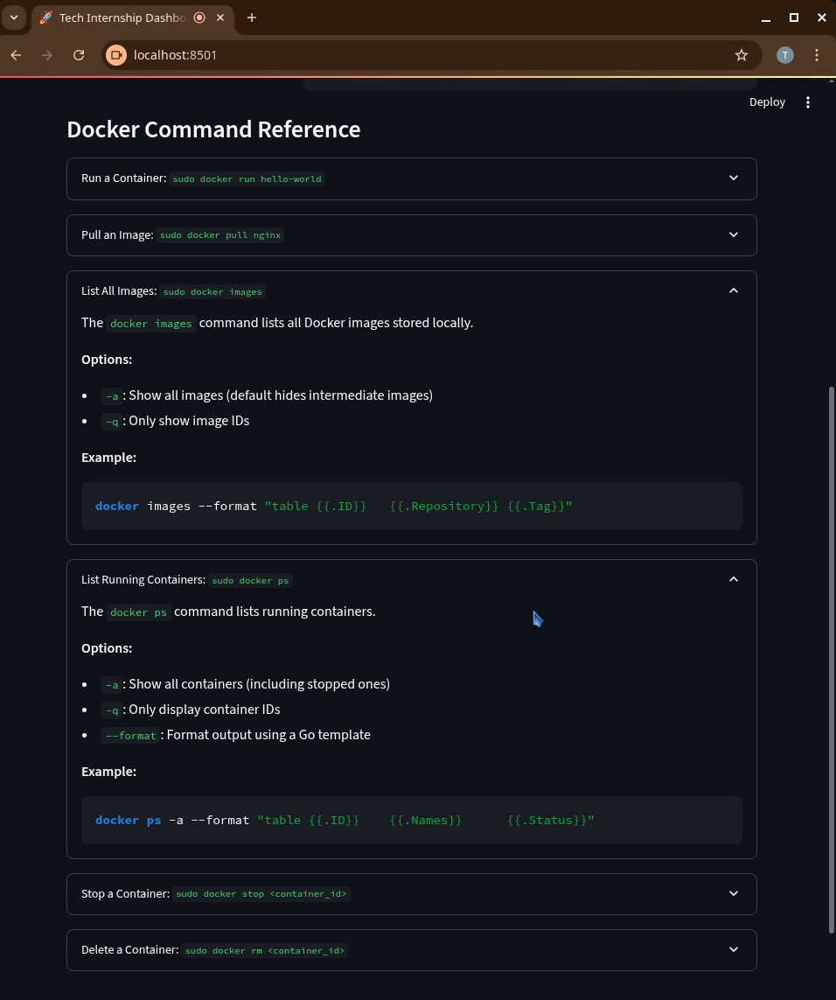
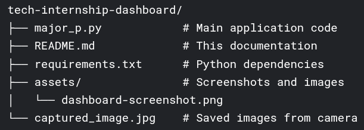

# Tech Internship Dashboard 🚀

A comprehensive Streamlit application that combines AI/ML, FullStack development, DevOps, and Generative AI tools into a single interactive dashboard.

## Features ✨

### 1. AI/ML Section 🤖
- **User Profile System**: Upload files and save personal details
- **Marks Prediction**: Linear Regression model that predicts exam scores based on study hours
  - Interactive visualization
  
  - Real-time predictions
  
  - Model accuracy metrics
  

---
### 2. FullStack Section 💻
- **Media Tools**:
  - Camera capture with save functionality
  - Video recording simulation (10 seconds)
  

- **Location Services**:
  - Fetch and display your current location
  - Interactive map visualization
  

- **HTML Interpreter**: Live HTML rendering


---
### 3. DevOps Section 🐳
- **Docker Command Center**:
  - Run common Docker commands (simulated)
  - Detailed command explanations
  - Example outputs
  

- **Command Reference**: Learn essential Docker commands



---
### 4. Generative AI Section 🧠
- **Gemini API Integration**:
  - Chat interface with AI
  - API key configuration
  - Real-time responses
  


---
## Installation ⚙️

1. Clone the repository:
```bash
git clone https://github.com/yourusername/tech-internship-dashboard.git
cd tech-internship-dashboard
```
2. Install dependencies:
    

```bash

pip install -r requirements.txt
```
3. Run the application:
    

```bash

streamlit run major_p.py
```
## Requirements 📋

- Python 3.8+
    
- Streamlit
    
- Pandas
    
- NumPy
    
- scikit-learn
    
- google-generativeai
    
- geopy
    
- opencv-python
    
- Pillow
    

## Configuration ⚙️

For the Generative AI section, you'll need:

1. A Gemini API key from [Google AI Studio](https://aistudio.google.com/)
    
2. Add your key in the Generative AI tab when the app runs
    

## Usage Guide 📖

1. **AI/ML Section**:
    
    - Fill in your details and upload files
        
    - Experiment with the marks prediction model
        
2. **FullStack Section**:
    
    - Take photos with your webcam
        
    - "Record" videos (simulated)
        
    - Fetch your location
        
    - Test HTML code in real-time
        
3. **DevOps Section**:
    
    - Learn Docker commands
        
    - See simulated outputs
        
    - Study command explanations
        
4. **Generative AI**:
    
    - Enter your API key
        
    - Chat with the AI model
        
    - Get responses to any prompt
        

## Project Structure 📂



## Troubleshooting 🛠️

**Common Issues:**

1. **Location not working**:
    
    - Ensure you have an internet connection
        
    - The geolocation service may not be precise
        
2. **Gemini API errors**:
    
    - Verify your API key is correct
        
    - Check your internet connection
        
3. **Docker commands not executing**:
    
    - These are simulations for learning purposes
        
    - For real commands, use your system terminal
        

## Contributing 🤝

Contributions are welcome! Please follow these steps:

1. Fork the repository
    
2. Create a new branch (`git checkout -b feature/your-feature`)
    
3. Commit your changes (`git commit -m 'Add some feature'`)
    
4. Push to the branch (`git push origin feature/your-feature`)
    
5. Open a Pull Request
